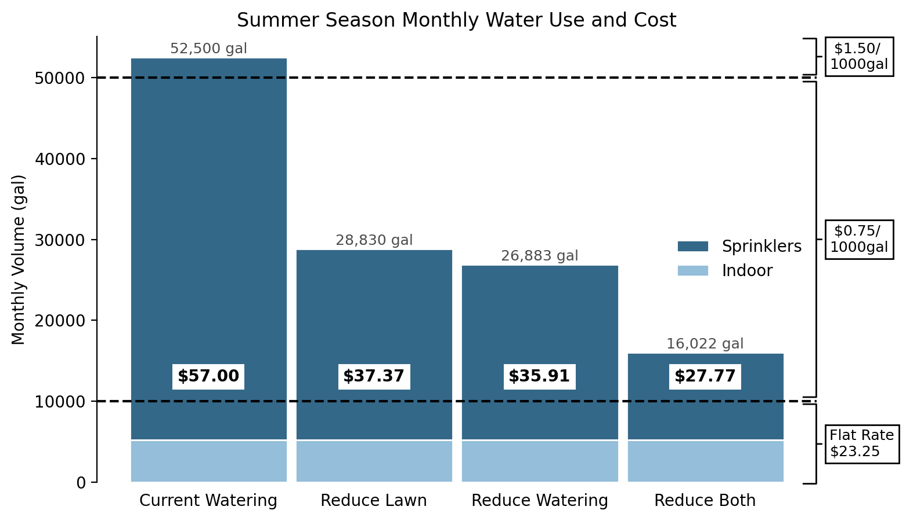
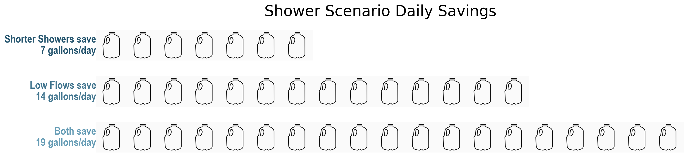

# Visualization of Household Water Use Data

By monitoring household water use with smart sensors and associated algorithms, homeowners, residents, and utilities can better understand not only the quantity of water used, but how and when the water is used. Increased information can help target uses and times for water conservation and cost savings. This repository contains code and images for visualizing water use for a single household. The overall water use is considered along with separate focus on outdoor and indoor uses. Several scenarios are presented as potential opportunities for water conservation. While these graphics correspond to a single, specific household, the code could be generalized to any home with similar data.

These visualizations are designed for presentation to consumers, and could be compiled into a report with portions of and variations of the explanatory text included for each visualization shown below. More complex figures were created for data exploration, many of which were deemed too scientific and specialized to be useful to a typical homeowner or resident. Even with the simplicity of the below plots, subsets or variations should be considered to ensure clarity and accessibility.

This repository was created December 2020 as a submission for a [data visualization challenge](https://github.com/UCHIC/CIWS-VisChallenge/) sponsored by the Cyberinfrastructure for Intelligent Water Systems Research Group at Utah State University.

## Code Structure and Input Data
The code consists of three main scripts: FlowPlots.py, IrrigationCostScenarios.py, and IndoorWaterUse.py. FlowPlots provides an overview of water use, IrrigationCostScenarios focuses on outdoor water use and cost, and IndoorWaterUse examines categories and timing of indoor water use. Each script can be run independently.

Input for all of these scripts is a comma separated values files of classified and labeled household water use events. Each row corresponds to a water use event. Required columns are StartTime, Label, Volume, and Duration. The input file supplied for the challenge contained data for a single household in Providence City, UT for 2 weeks during the summer. The code is specific to category labels in this file (irrigation, hose, toilet, shower, faucet, clothwasher), but could be repurposed for other categories or labels.

Input data is found in the same root directory as the scripts. Background images that are imported into illustrated visualizations are located in the Images folder along with saved versions of script outputs. Power Point software was use to create and export some backgrounds, and associated files are in the BackgroundCreation folder.

## Overall Water Use
The FlowPlots script imports data, aggregates all events by category, and determines daily averages. Data are further organized as in/out flows for plotting. Two plots are constructed and put together for a single visualization: first to illustrate the split between indoor and outdoor use, and then to show the proportions of indoor use. A separate plot is used for indoor because, for the timeframe for this example, outdoor water use overshadowed indoor use. All numbers in the plots are daily averages.

As shown here, a vast majority of water used by the household in this period goes to outdoor uses - primarily irrigation of turfgrass by automated sprinkler system along with a relatively small amount of hose use. For the 130 gallons used indoor each day, toilet flushes and showers consume the most water along with some faucet and clothes washer. Note that 'faucet' includes both sink use and automatic dishwashing.

## Outdoor Water Use
Because of the dominance of outdoor water use, possibilities for reduction are explored and compared to the current baseline. The IrrigationCostScenarios script determines monthly watering volume and cost for three scenarios. This analysis is only applicable to the summer irrigation season. (Note that irrigation = sprinklers = watering.)

### Scenarios
Three scenarios are considered:
1. **Reducing the irrigated area:** This scenario explores water use if the irrigated area were reduced by swapping turfgrass for xeriscaped plants and other landscaping elements that do not require watering. For this case, the irrigated area was reduced by half.
2. **Reducing the rate of irrigation:** The need for watering depends on weather and soil type, so it can be difficult to broadly prescibe rates and a schedule. To conserve water, a [general recommendation](https://www.lowes.com/n/how-to/watering-tips) is to water 1 inch of water per week. The script determines the monthly water use for 1 inch/week as well as the current depth/week using the given lot size and assuming a fraction of that acreage is watered (because of the house and paved surfaces). For this household, the lot size was 0.28 and the lot fraction was estimated as 2/3.
3. **Both:** A final scenario considers reducing both the irrigated area and the rate of irrigation.

### Pricing
The City of Providence, UT uses a tiered pricing structure to charge for water use with rates as follows: 
- $23.25 for 10,000 gallons of water (flat rate).
- $0.75 per 1,000 gallons from 10,001 to 50,000 gallons.
- $1.50 per 1,000 gallons over 50,000 gallons.

Using these rates, the total pricing for each scenario was determined.

### Plots and Illustrations
The water use and pricing information for each scenario is visualized in a bar chart. Each bar represents total monthly household water use for each scenario. Indoor use is constant while outdoor use varies. Dashed lines indicate the pricing tiers, and total monthly cost is shown for each scenario. Note that this is only applicable to summer irrigation season.

These plots indicate the savings that can be realized with increased water conservation. For this household, reducing either lawn area or watering rate saves around $20/month during the summer season. Implementing both could save $30/month. Note that for this household, all indoor water use (and some outdoor use) are included in the flat rate.

 The illstrations below visualize the impact of each of the scenarios. In the upper illustration, the relative portions of irrigated area are shown as a full lawn and a partially xeriscaped landscape to show reduced irrigated area. In the lower figure, the current baseline weekly watering depth is shown next to the recommended depth to illustrate the opportunity for reduction. These are overlaid on an image of grass to show where the water is going.
 
 
 
 ## Indoor Water Use
For this house and time period, outdoor water use dominated and presents the greatest opportunity for conservation; however, outdoor use will not be significant for portions of the year and may not be as relevant for some households. Given the flat rate for the lowest use tier in Providence, there isn ot a financial incentive to conserve indoor water, nevertheless, some consumers may want to go beyond outdoor conservation. The IndoorWaterUse script explores various indoor uses including timing and variability and potential paths for conservation. The below plot illustrates the ranges of event duration for each category. Because volume is directly related to duration, the range of durations also indicates the range of volumes. 

For faucet, clothes washer, and toilet, all events are of similar duration to others in the same category. On the other hand, the shower event durations vary widely. Compared to the other uses, showers offer the greatest opportunity for conservation, so three scenarios are considered for reducing shower water use. Note that toilet flushes use more overall water than showers, so opportunity for reduction could occur if residents are willing to flush less, however, acceptance of messaging on toilet flush conservation may not be palatable to residents (e.g., "if it's yellow, let it mellow").

### Timing
To visualize when water is being used in different areas of the house, the data are split into hours when the event occurred and plotted.

Shower volume is greatest 9am-12pm and 4-6pm, and those are the hours with the most use overall. Toilet and faucet use are fairly consistent throughout the day. Clothes washing mostly occurs 9am-1pm. Information on the typical shower duration for each hour can help target specific times or individuals. The below plot illustrates the range of shower duration for each hour of the day.

This plot further shows that 9am-12pm, 4-5pm, and 9-10pm are times when relatively lengthy showers are occurring - both the maximum and the average are higher than other times of day. With this information, the household can target reduction efforts on showers that occur during those times of the day -- this is the focus of one of the scenarios.

### Shower Scenarios
As shown by the previous visualizations, shower events are the best opportunity for reducing indoor water use. Three scenarios are considered:
1. **Reduce Shower Duration:** A maximum shower duration is set. For this case, 10 minutes was selected as a maximum shower length. Any showers over 10 minutes are set to 10 minutes and the total daily volume determined.
2. **Ultra Low Flow:** Low flow fixtures can impose conservation when shorter showers are not welcomed by household members. There is a wide range of low flow fixtures available to consumers. This scenario sets a low flow rate and determines total daily volume used for the shower events in the dataset. (Note that for this household, the average flow rate was 1.88 gpm, which may be considered "low flow". Recent innovations in shower fixtures [reportedly output](https://nebia.com/collections) 1.26 gpm.)
3. **Both:** A final scenario implements both shorter showers and a reduced shower flow rate. 

### Plots and Illustrations
Several visualizations present the water used by each shower scenario. The bathtub illustration shows total daily shower volume for each scenario as water depth scaled to a typical bathtub. The same numbers are presented in a bar chart where each bar corresponds to a scenario. To visualize the water conserved in each scenario, savings are presented in terms of gallon jugs.

These visualizations illustrate the water conservation potential of enforcing shorter showers and using a low flow fixture. For this household, the average daily shower volume was equivalent to a full bathtub (42 gallons). Implementing both of these practices would save 19 gallons of water each day (45%).
