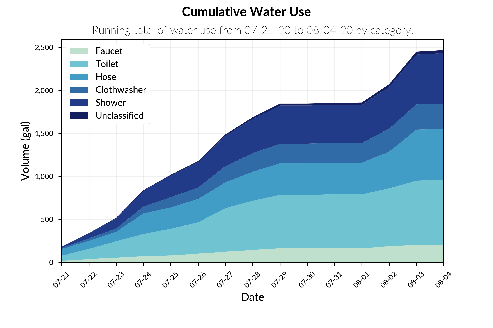
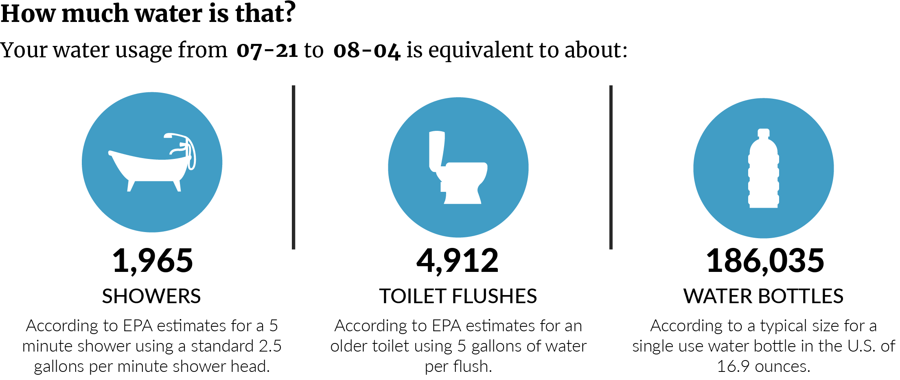

<!-- PROJECT LOGO -->
<br />
<p align="center">
  <a href="https://github.com/othneildrew/Best-README-Template">
    
      <br />
  </a>

  <h1 align="center">CIWS-VisChallenge</h1>

  <p align="center">
    Data visualizations developed for the 2020 Cyberinfrastructure for Intelligent Water Supply (CIWS) Data Visualization Challenge.
    <br />
    <br />
    <a href="https://github.com/nguymon/CIWS-VisChallenge/blob/main/Visualization%20Guide.md">Visualization Guide</a>
    ·
    <a href="https://github.com/nguymon/CIWS-VisChallenge/blob/main/Style%20Guide.md">Style Guide</a>
    ·
    <a href="https://github.com/nguymon/CIWS-VisChallenge/blob/main/CIWS-VisChallenge.ipynb">Jupyter Notebook</a>
    ·
    <a href="https://github.com/nguymon/CIWS-VisChallenge/tree/main/Presentation">Presentation Slides</a>
  </p>
</p>

<!-- TABLE OF CONTENTS -->
<details open="open">
  <summary>Table of Contents</summary>
  <ol>
    <li>
      <a href="#about-the-project">About The Project</a>
      <ul>
        <li><a href="#built-with">Built With</a></li>
      </ul>
    </li>
    <li>
      <a href="#getting-started">Getting Started</a>
      <ul>
        <li><a href="#prerequisites">Prerequisites</a></li>
        <li><a href="#installation">Installation</a></li>
      </ul>
    </li>
    <li><a href="#usage">Usage</a></li>
    <li><a href="#license">License</a></li>
    <li><a href="#contact">Contact</a></li>
    <li><a href="#acknowledgements">Acknowledgements</a></li>
  </ol>
</details>

<!-- ABOUT THE PROJECT -->
## About The Project

The purpose of this project is to visualize high temporal resolution water use data from a residential home. These visualizations are to be used in communicating usage trends to the homeowner(s) in ways that may help to reduce future usage.

Here's why:
* Water usage data is rarely shown in individual categories.
* High resolution visualizations can better help understand trends.
* Open-source alternatives are needed in collecting water usage data.

A further description of the project's goals and data visualized can be found here:
* [Project Description](https://github.com/UCHIC/CIWS-VisChallenge)
* [Visualization Datasets](https://github.com/UCHIC/CIWS-VisChallenge/blob/master/2020_Challenge/data/readme.md)

For additional information about the data or project contact Jeff Horsburgh at jeff.horsburgh@usu.edu.

### Built With

The project was built primarily using:
* [**Python** 3.8.4](https://www.python.org/downloads/release/python-384/)
* [**Jupyter Notebook** 1.0.0](https://jupyter.org/)
* [**Pandas** 1.0.5](https://pandas.pydata.org/)
* [**Matplotlib** 3.2.2](https://matplotlib.org/)
* [**Seaborn** 0.10.1](https://seaborn.pydata.org/)
* [**Plotly** 4.13.0](https://plotly.com/)
* [**Pillow** 7.2.0](https://pillow.readthedocs.io/en/stable/)

If using a different version of packages it may be necessary to update sections of the project.

<!-- GETTING STARTED -->
## Getting Started

The visualization were completed in Jupyter Notebook using an [Anaconda distribution](https://www.anaconda.com/).

### Installation
The project uses packages installed with the Anaconda distribution and additional packages listed below. If using a different Python distribution, additional packages may need to be installed. Main packages include:

* Matplotlib
* Seaborn
* Plotly
* Pillow

Plotly 4.9 or above is recomended for generating the table visualization. 
1. Check version
```sh
# Check version
conda list
```
```sh
# Install or update
conda listconda install -c anaconda pillow
```

<!-- USAGE EXAMPLES -->
## Usage

The visualizations are designed to be easy to understand, visually appealing, and informative. Each is designed to be useful in a printed report, webpage, or other applicable reporting mediums.

#### Stacked Plot Example


This plot is used to compare the relative breakdown of water usage between categories.

#### Infographic Example


This infographic helps to visualize water usage compared to household items that a typical homeowner uses on a regular basis.

#### Other Examples
_For more examples please refer to the [Visualization Guide](https://github.com/nguymon/CIWS-VisChallenge/blob/main/Guides/Visualization%20Guide.md)_

<!-- LICENSE -->
## License

Distributed under the MIT License. See `LICENSE` for more information.

<!-- CONTACT -->
## Contact

Nathan Guymon - nathan.guymon@aggiemail.usu.edu

Project Link: [CIWS-VisChallenge](https://github.com/UCHIC/CIWS-VisChallenge)

<!-- ACKNOWLEDGEMENTS -->
## Acknowledgements
* [README Template](https://github.com/othneildrew/Best-README-Template)