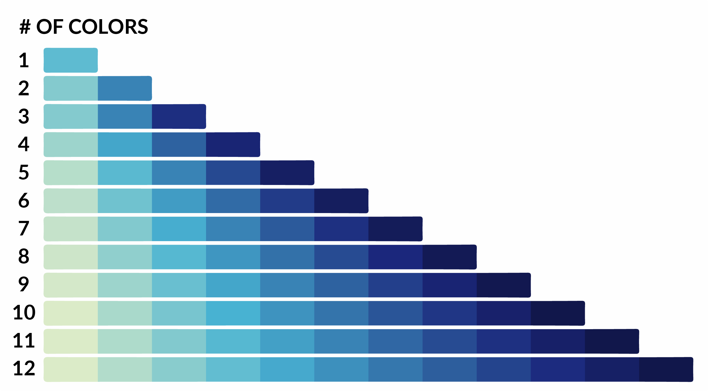
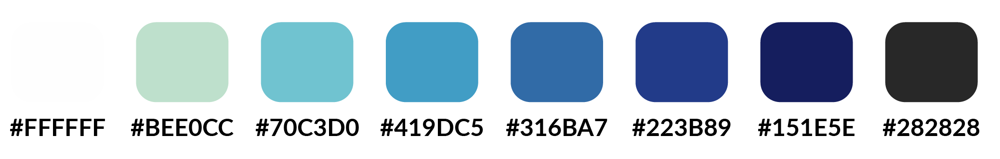

# Style Guide
A summary of the fonts, colors, and other styling used in the Jupyter Notebook.

<!-- TABLE OF CONTENTS -->

  
Table of Contents

  <ol>
    <li><a href="#color-palette">Color Palette</a></li>
    <li><a href="#fonts">Fonts</a></li>
    <li><a href="#references">References</a></li>
  </ol>

<!-- COLOR PALETTE -->
## Color Palette
### Visualization Palette
The color palette was selected to maximize visibility of the data. The palette is focused on having a range in both hue and brightness to make values easy to distinguish. Colors were also selected to feel more naturally similar to the color of water. The palette used is adapted into the visualization from Graphic Engineering [1,2].

### Report Palette
For a written report or webpage there is a need for fewer colors. A palette is prented below that would be ideal for these purposes.

<!-- COLOR PALETTE -->
## Fonts
The main fonts used in the project are Lato and Merriweather. Both are available in Matplotlib and Seaborn and also available for use online. The true type files are also found [here](https://github.com/nguymon/CIWS-VisChallenge/tree/main/Fonts).

Additional details about the fonts and their use are found in the Jupyter Notebook.
<!-- REFERENCES -->
## References
[1] https://blog.graphiq.com/data-visualization-color-palettes-37fbc8fc0032

[2] https://blog.graphiq.com/finding-the-right-color-palettes-for-data-visualizations-fcd4e707a283#.g2we5pt3q/